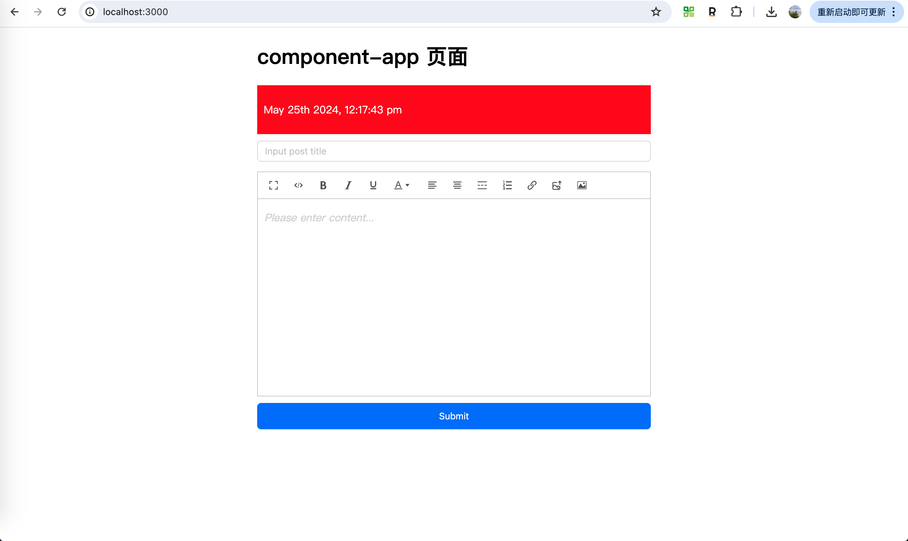

# react-ModuleFederationPlugin

### 1.componentApp
```bash
cd componentApp
npm install
npm run start
```
### 2.preview componentApp


### 3.mainApp
```bash
cd mainApp
npm install
npm run start
```
### 4.preview mainApp

